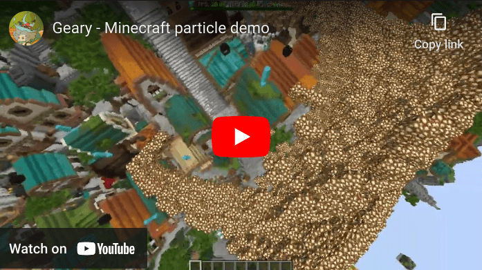
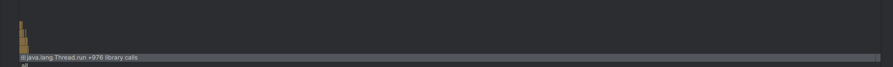
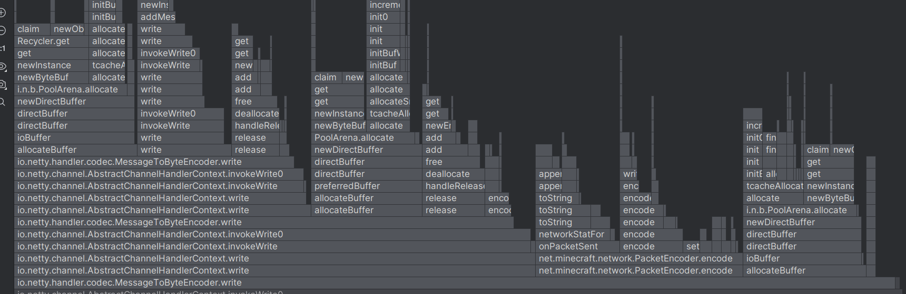

[View the source code on GitHub](https://github.com/MineInAbyss/particles/)

Geary is an entity component system I wrote, with a companion [PaperMC plugin](https://github.com/MineInAbyss/Geary-papermc) that lets us run it on a modified Minecraft server. This page explores how we can use Geary to create an extendable particle system with little overhead. We'll explore code samples from the plugin available on GitHub, but won't focus on syntax. You can read the [Geary quickstart guide](https://docs.mineinabyss.com/geary/quickstart/) if you want to get a better idea of it.

In the showcase below, we get to around 10k particles using block entity packets before client fps starts to tank, with a lot more headroom on the server end (see the end of this post):

[](https://www.youtube.com/watch?v=QzaAQEHklFI)

<figcaption>
Block entities are great replacements for regular Minecraft particles because we can apply fancy transformations, custom (potentially animated) models, these can even be flat planes that are essentially just traditional particles, but with proper interpolation on the client.
</figcaption>

## Setting up our plugin

We configure geary in `onLoad` and make an addon to add our systems to.

```kotlin
val ParticlesAddon = createAddon("Particles") {
    systems {
        applyVelocity()
        findNearestPlayerPosition()
        homing()
        
        spawnMinecraftEntities()
        moveMinecraftEntities()
        removeAssociatedMinecraftEntity()
        // ...
    }
}

// ... in onLoad:
gearyPaper.configure {
    install(ParticlesAddon)
}
```

## Setting up our data

We create some components for position data:

```kotlin
data class Position(var x: Double, var y: Double, var z: Double)

data class TargetPosition(var x: Double, var y: Double, var z: Double)

data class Velocity(var dx: Double, var dy: Double, var dz: Double)
```

And some markers for customizing our particles (these store no data but can be queried against):

```kotlin
sealed class HomingAtTarget

sealed class TargetNearestPlayer

sealed class ConsumedByNearestPlayer
```

## Targeting systems

Update our position based on velocity: 
```kotlin
fun Geary.applyVelocity() = system(query<Position, Velocity>())
    .every(1.ticks)
    .exec { (position, velocity) ->
        position.x += velocity.dx
        position.y += velocity.dy
        position.z += velocity.dz
    }
```

Next we find the nearest Minecraft player and update the TargetPosition component to match.

```kotlin
fun Geary.findNearestPlayerPosition() = system(query<Position, TargetPosition> { has<TargetNearestPlayer>() })
    .every(1.ticks)
    .execOnAll {
        val players = Bukkit.getOnlinePlayers() as List<Player>
        val playerLocs = Array(players.size) { players[it].location.toVector() }
        if (playerLocs.isEmpty()) return@execOnAll
        forEach { (position, targetPosition) ->
            var minIndex = 0
            var minDist = Double.MAX_VALUE
            playerLocs.fastForEachWithIndex { index, it ->
                if (it.distanceSquared(Vector(position.x, position.y, position.z)) < minDist) {
                    minDist = it.distanceSquared(Vector(position.x, position.y, position.z))
                    minIndex = index
                }
            }
            val closest = playerLocs[minIndex]
            targetPosition.x = closest.x
            targetPosition.y = closest.y
            targetPosition.z = closest.z
        }
    }
```

<figcaption>

Note that this is a fairly unoptimized solution, but works perfectly fine so long as the player location array can fit comfortably into cache, which for any reasonable player count should be fine. Later on we mention how we might go about further improving this by chunking our entities based on location.

As well, this snipped shows how we can use `execOnAll` to gather data before we start iterating all our entities, so we don't need to recalculate a list of players for each entity:
</figcaption>

Finally, we add a homing system with some basic code to approach TargetPosition.

```kotlin
fun Geary.homing() = system(query<Position, Velocity, TargetPosition> { has<HomingAtTarget>() })
    .every(1.ticks)
    .execOnAll {
        val maxSpeed = 0.1
        forEach { (position, velocity, targetPosition) ->
            // update position to home on player's location with
            val distance = Vector(targetPosition.x - position.x, targetPosition.y - position.y, targetPosition.z - position.z)
            if (distance == Vector(0, 0, 0)) return@forEach
            val direction = distance.normalize() * maxSpeed
            velocity.dx = velocity.dx * 0.95 + direction.x.coerceIn(-maxSpeed, maxSpeed)
            velocity.dy = velocity.dy * 0.95 + direction.y.coerceIn(-maxSpeed, maxSpeed)
            velocity.dz = velocity.dz * 0.95 + direction.z.coerceIn(-maxSpeed, maxSpeed)
        }
    }
```

## Rendering systems

We can also add components that describe how to render entities, this lets us use the same systems for regular Minecraft particles, or write logic to handle block entities, all completely independently.

For block entities, we construct a spawn packet, then send move packets if the distance hasn't changed too much, otherwise we send teleport packets. I won't go over specifics since they become a little involved, so we'll just give an outline here.

Create new components:

```kotlin
data class RenderAsEntity(
    val material: Material,
    val scale: Vector = Vector(1, 1, 1),
    val translation: Vector = Vector(0, 0, 0)
)

data class RenderAsEntitySpawned(val id: Int, var lastPosition: Position)
```
Add a listener to send the spawn packet:

```kotlin
// This will fire when both Position and RenderAsEntity become present on the entity
fun Geary.spawnMinecraftEntities() = observe<OnSet>()
    .involving(query<Position, RenderAsEntity>())
    .exec { (position, render) ->
    // ... Logic to create the entity spawn packet
    // Set a component to label this entity as spawned
  entity.set(RenderAsEntitySpawned(entityId, position.copy()))
}
```

Next, we send move packets using the Bundle packet to reduce size:

```kotlin
fun Geary.moveMinecraftEntities() = system(query<Position, RenderAsEntitySpawned>())
    .every(1.ticks)
    .execOnAll {
        map {
            // create move packets
        }.chunked(MAX_BUNDLE_SIZE).fastForEach { chunk ->
            players.fastForEach {
                it.toNMS().connection.send(
                    ClientboundBundlePacket(chunk)
                )
            }
        }
    }
```

Finally we send a remove packet when entities get removed:

```kotlin
fun Geary.removeAssociatedMinecraftEntity() = observe<OnEntityRemoved>()
    .exec(query<RenderAsEntitySpawned>()) { (spawned) ->
        val world = Bukkit.getWorld("world")!!
        val players = world.players
        players.fastForEach {
            it.toNMS().connection.send(ClientboundRemoveEntitiesPacket(spawned.id))
        }
    }
```

## Creating our particles

Let's spawn in some particles now, in our example plugin we do this via a command that creates the following entity:

```kotlin
entity {
    set(Position(x, y, z)) // based on player running command
    set(
        Velocity(
            Random.nextDouble(-3.0, 3.0),
            Random.nextDouble(-3.0, 3.0),
            Random.nextDouble(-3.0, 3.0)
        )
    )
    set(RenderAsEntity(Material.GLOWSTONE, scale = Vector(0.3, 0.3, 0.3)))
    add<TargetNearestPlayer>()
    add<HomingAtTarget>()
}
```

## Extendability

Notice ECS let us define our homing system using just a target location, we can define other systems that choose a target, and home towards them, without actually caring where that target came from.

Likewise, we saw how our rendering code could be completely separate from our position updating systems. This is the charm of ECS, we get to keep everything modular, and we can define complex entities purely with data. In fact, Geary comes with a prefab module that would let us define these entities entirely in configs.

## Performance notes

The majority of the TPS increase you see in the showcase comes from Minecraft's networking stack struggling to encode and send this many
packets. Geary adds almost no overhead for all the following code: storing all the particles, displaying them as block
entities using packets, following nearby players, running distance checks to remove entities near the player.

At ~20k particles, my machine with fairly modern AM4 hardware, running many clientside optimization mods struggles seriously, but the server has headroom for more, which means with some network stack optimizations this could easily
handle thousands of particles for many players. *(Perhaps a project for another day?)*

Below is a flamegraph from a similar situation near the end of the showcase video where 10k particles were spawned several
times, 



<figcaption>In yellow you can see all code related to this project.</figcaption>



<figcaption>A slightly zoomed in view of the gray part, we see Netty and Minecraft's packet encoding code taking up most of the tick.</figcaption>

## Future work

### Shortcuts we took

We took a few shortcuts in the examples above with assuming a single world and sending packets to all players. With a bit more work, we can add a system that calculates not just the nearest player's position as shown but also any players within range to get the packets.

### Self-interacting particles

I'd like to revisit this problem in a future post since Geary is currently missing syntax to do this nicely, however I'll outline a general ECS-like idea for this problem. For particles that need to interact with each other, a common approach to improve speed is to group nearby particles using a grid. We can leverage Geary's archetype structure to define this using relations.

We look at a particle's position as integers divided by some number, say 16 to match Minecraft chunks. We create an entity for each of our chunks then add a relation, say `ContainedIn` using `entity.addRelation<ContainedIn>(ourChunkEntity)`. Moreover, we can store a component on the chunk entity that contains entity ids for the chunks above, below, etc... this chunk if we need to reference nearby chunks.

This way, Geary will automatically group together entities with nearby positions (notably with future JVM improvements this will group entities with the same components continuously in memory.) Then, we can query for any entities with the `ContainedIn` relation.

What's currently missing is syntax to be able to partition our entities based on exactly the chunk they're contained in, since we're interested in doing calculations for each chunk (ex. a n^2 loop restricted to only entities in that chunk.) Right now, it's possible to query for the relation `ContainedIn <some entity>`, but only on the individual entity level.
