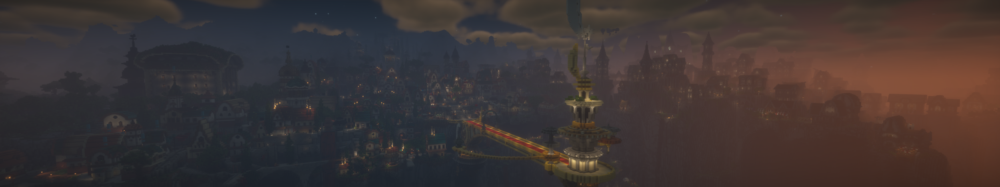
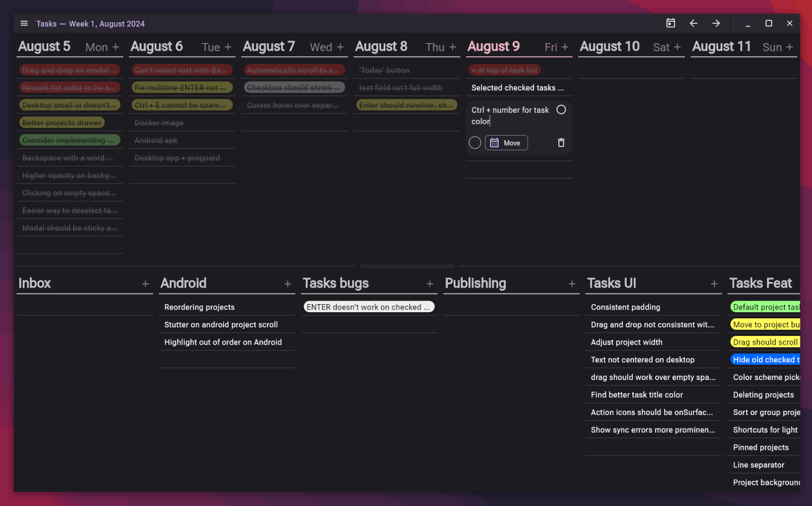

## Geary *([source](https://github.com/MineInAbyss/Geary))*

An entity component system I wrote from the ground up in Kotlin. It lets users write fast code in a modular way by making systems that quickly iterate over entities with desired data. It uses archetypes for its architecture, and the design would allow for data to be packed tightly in memory once value objects are added to Java. It also has entity relations built into the engine, inspired by [flecs](https://github.com/SanderMertens/flecs).

*You can see a demo in my blog post [Making an efficient Minecraft particle system using ECS](blog/geary/particle-system)*

## Sysadmin work at *[Mine in Abyss](https://mineinabyss.com/)*

A community-driven recreation of Made in Abyss in Minecraft. I did game development and server infrastructure work across several projects that help us deploy and maintain servers as a small team, here's a quick summary of my work there:

- Created [Keepup](https://github.com/MineInAbyss/Keepup), a CLI tool to manage server plugin dependencies and configs, including support for templates with minimum startup time overhead.
- Worked extensively with [Grafana](https://grafana.com/) to set up server monitoring that's helped greatly with diagnosing tps issues. I've also made a small Paper plugin to easily set up [Pyroscope](https://github.com/MineInAbyss/pyroscope-mc/) for continuous profiling.
- Automated machine provisioning with an [Ansible playbook](https://github.com/MineInAbyss/ansible-in-abyss) that sets up a new server and services via Docker compose.
- I also made a [per-server config propagation playbook](https://github.com/MineInAbyss/server-config) that pulls and copies config updates from GitHub, including private repositories for things like custom models.
- Made [custom Docker images](https://github.com/MineInAbyss/Docker) that help tie all our tools into one package that's useful for production and local development.

<figcaption>The golden bridge in Orth overlooks the Abyss</figcaption>

## Weekly task planner *([source](https://github.com/0ffz/tasks))*

A cross-platform task and week planning app written on Jetpack Compose, with a sync server. It uses sqlite for storage, with near-instant startup times on Android, alongside a quick-add feature.

<figcaption>The application home screen on Desktop</figcaption>

## Game jams

I've worked in Unity and Godot with C# to create games for game jams. My latest entry was [Rock Bottom](https://github.com/0ffz/Ludum-Dare-46) in Ludum Dare 46. I worked in a team of three to create a physics puzzle game using an event driven architecture.

<figcaption>Pet rocks in the pet rock shop return home</figcaption>

## Frontend roundup

I've worked on a few projects involving more frontend work:

- [This website](https://dvyy.me) is built using [Shocky](https://github.com/0ffz/shocky) a mini static site generator I wrote in Kotlin. I can split things into reusable components without any client side JavaScript required. Learn more on its [project page](https://github.com/0ffz/personal-site).
- [Clicky](https://github.com/0ffz/Clicky), an online vote room I made for a professor that wanted students to be able to answer impromptu questions in class. It's built on Django and the frontend is mostly pure HTML with skeleton CSS applied.

